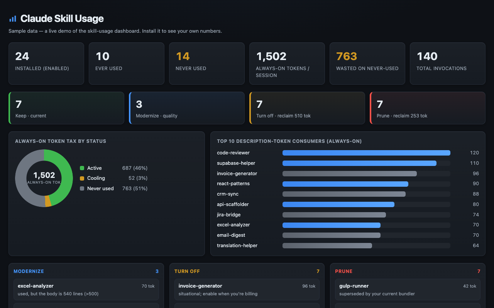

# skill-usage

See which Claude skills you actually use — and what to cut.

Most people accumulate dozens of skills and plugins. Every *enabled* one puts its name and description into context **every session**, whether you ever use it or not. `skill-usage` reads your local Claude transcripts, shows you the real numbers, and recommends what to keep, modernize, turn off, or prune.


It answers two questions you otherwise can't see:

1. **How often is each skill used, and what does it cost?** — usage counts, last-used date, and token cost across your global, project, and plugin skills.
2. **What should I do about each one?** — a Keep / Modernize / Turn off / Prune verdict per skill, with a one-line reason.

## Privacy

It runs entirely on your machine. It reads `~/.claude` transcripts locally and writes a local HTML file. **Nothing is uploaded.** There is no server.

## Two token costs

- **Always-on tax** — a skill's name + description sit in context every session, paid even if never used. This scales with the *number* of enabled skills; it's what turning a skill off reduces.
- **On-invoke cost** — the full skill body, loaded once only when the skill actually fires.

The biggest savings come from the skills you never invoke.

## What it looks like

The dashboard: stat cards, an always-on token-tax donut, top token consumers, a Keep / Modernize / Turn off / Prune action strip, a bucket board, and a sortable table.



## Install

**As a Claude Code plugin (recommended):**

```bash
claude plugin marketplace add paultaki/claude-skill-usage
```

Then, inside Claude Code:

```
/plugin install skill-usage@skill-usage
```

It's now available as `/skill-usage`. Update later with `claude plugin marketplace update skill-usage`.

**As a standalone script (no Claude required for the usage view):**

```bash
git clone https://github.com/paultaki/claude-skill-usage
python3 claude-skill-usage/skills/skill-usage/scripts/skill-usage.py --open
```

**Manually (drop-in skill):** copy `skills/skill-usage/` into `~/.claude/skills/`.

## Usage

Fast, deterministic view (usage + token cost + a heuristic baseline verdict):

```bash
python3 skills/skill-usage/scripts/skill-usage.py --open
```

Flags: `--open` open the dashboard · `--prune` print the never-used prune list · `--rescan` ignore the cache · `--demo` build a sample-data dashboard (no transcripts needed — handy for a hosted demo).

The first run parses all transcripts; later runs only re-parse new or changed files (cached on `mtime`+`size`), so they're near-instant. Token counts use `tiktoken` if installed, otherwise a `chars/4` estimate (the dashboard labels which). `pip install tiktoken` for a closer number.

### Full recommendations

The usage view ships with quick heuristic verdicts. For real recommendations — graded against your own `CLAUDE.md` and Anthropic's current skill-authoring docs — run the skill in Claude Code and ask for the recommendation pass. It writes `recommendations.json`, which the dashboard renders. See [`skills/skill-usage/SKILL.md`](skills/skill-usage/SKILL.md) for the steps.

## Output

Everything is written to `~/.claude/skill-usage/`:

- `dashboard.html` — the dashboard
- `data/skill-usage.json` — usage + tokens + lint + baseline
- `data/recommendations.json` — verdicts from the recommendation pass

## Acting on recommendations

The dashboard is read-only. In Claude Code you can then say "modernize these / prune those / turn off the rest" and it will edit your own skills, archive-move prunes to `~/.claude/skills-archive/` (reversible), or print the `/plugin` steps for plugin skills. Nothing runs without you; archive, not delete, is the default.

## License

MIT — see [LICENSE](LICENSE).
